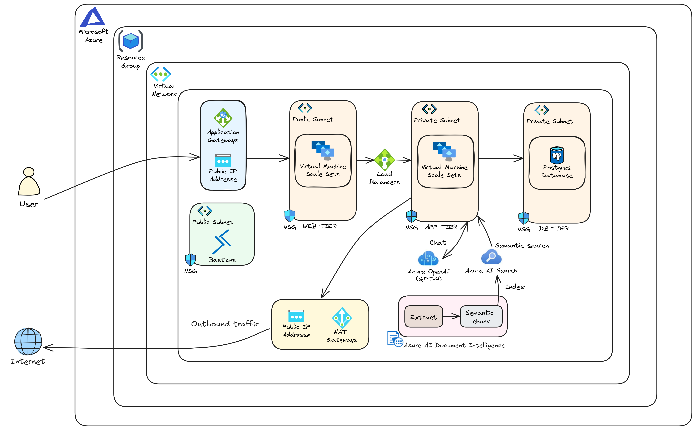

# Omnisearch - AI-Powered Document Search App

<div align="center">


**Omnisearch** is a modern, cloud-native application that enables users to search, discover, and interact with documents using advanced AI technologies. Built with a 3-tier architecture on Azure, it provides semantic search, AI-powered Q&A, and real-time document conversations.


</div>

## 🌟 Features

- **🔎 Semantic Search**: Find documents by meaning, not just keywords using Azure AI Search
- **🤖 AI-Powered Q&A**: Ask questions about document content with OpenAI integration
- **📄 Multi-format Support**: PDF, Word, PowerPoint, and text files
- **💬 Real-time Chat**: Interactive document conversations with citation tracking
- **☁️ Cloud-Native**: Fully deployed on Azure with Infrastructure as Code
- **🚀 Scalable Architecture**: 3-tier architecture with auto-scaling capabilities
- **🔒 Secure**: Network isolation, Key Vault integration, and secure authentication

## 🏗️ Architecture

Omnisearch follows a **3-tier architecture** deployed on Azure:

<div align="center">
  
</div>

### Components

- **Frontend**: Next.js 14 with TypeScript, Tailwind CSS, and Radix UI
- **Backend**: FastAPI with async PostgreSQL, SQLAlchemy, and Alembic
- **Database**: PostgreSQL Flexible Server with private networking
- **AI Services**: Azure OpenAI, Document Intelligence, and AI Search
- **Infrastructure**: Terraform-managed Azure resources
- **CI/CD**: Azure DevOps pipelines with self-hosted agents

### Architecture Layers

1. **Presentation Layer**: Next.js frontend served via Application Gateway
2. **Application Layer**: FastAPI backend on VM Scale Sets with Internal Load Balancer
3. **Data Layer**: PostgreSQL with private networking, Azure AI Search index, and Azure Storage

## 📁 Project Structure

```
omnisearch/
├── frontend/                    # Next.js frontend application
│   ├── src/                    # Source code
│   │   ├── app/               # Next.js app directory
│   │   ├── components/        # React components
│   │   └── lib/              # Utilities
│   ├── Dockerfile             # Container configuration
│   └── README.md              # Frontend documentation
│
├── backend/                    # FastAPI backend application
│   ├── app/                   # Application code
│   │   ├── api/              # API routes
│   │   ├── core/             # Core functionality
│   │   ├── models/           # Database models
│   │   ├── schemas/          # Pydantic schemas
│   │   └── services/         # Business logic
│   ├── Dockerfile            # Container configuration
│   └── README.md             # Backend documentation
│
├── infrastructure/             # Infrastructure as Code
│   ├── terraform/            # Terraform configurations
│   │   ├── modules/         # Reusable Terraform modules
│   │   │   ├── networking/  # VNet, subnets, NSGs
│   │   │   ├── compute/     # VM Scale Sets
│   │   │   ├── database/    # PostgreSQL
│   │   │   ├── ai-services/ # Azure AI services
│   │   │   └── ...         # Other modules
│   │   ├── environments/    # Environment configs
│   │   └── README.md        # Infrastructure docs
│   └── pipelines/           # CI/CD pipelines
│       ├── azure-pipelines-frontend.yml
│       └── azure-pipelines-backend.yml
│
│├── scripts/                           # Utility scripts
│   ├── create-search-index.py        # Azure AI Search index creation script
│   └── install-devops-agent.sh        # DevOps agent installation script
│
├── docker-compose.yml                 # Local development Docker Compose
└── README.md                          
```

## 🚀 Quick Start

### Prerequisites

- **Azure Subscription** with appropriate permissions
- **Azure CLI** installed and configured
- **Terraform** >= 1.6.0
- **Docker** (for local development)
- **Node.js** 18+ (for frontend development)
- **Python** 3.12+ (for backend development)

### Local Development

#### 1. Clone the Repository

```bash
git clone https://github.com/alizoubair/omnisearch.git
cd omnisearch
```

#### 2. Set Up Backend

```bash
cd backend
python3.12 -m venv venv
source venv/bin/activate  # On Windows: venv\Scripts\activate
pip install -r requirements.txt

# Set up environment variables
cp .env.example .env
# Edit .env with your configuration

# Run the application
python run.py
```

The API will be available at:
- **API**: http://localhost:8000
- **API Docs**: http://localhost:8000/docs

#### 3. Set Up Frontend

```bash
cd frontend
npm install

# Set up environment variables
cp .env.example .env.local
# Edit .env.local with your configuration

# Start development server
npm run dev
```

The frontend will be available at http://localhost:3000

### Infrastructure Deployment

#### 1. Configure Terraform

```bash
cd infrastructure/terraform

# Copy example configuration
cp environments/dev/terraform.tfvars.example environments/dev/terraform.tfvars

# Edit terraform.tfvars with your Azure configuration
# Required: subscription_id, tenant_id, service_principal credentials
```

#### 2. Initialize and Deploy

```bash
# Initialize Terraform
terraform init

# Review the deployment plan
terraform plan -var-file=environments/dev/terraform.tfvars

# Apply the infrastructure
terraform apply -var-file=environments/dev/terraform.tfvars
```

This will create:
- Virtual Network with subnets
- VM Scale Sets for frontend and backend
- PostgreSQL Flexible Server
- Azure AI Services (OpenAI, Document Intelligence, AI Search)
- Application Gateway and Load Balancers
- Azure Container Registry
- Azure Key Vault
- Azure DevOps resources

## 🤖 AI Services

Omnisearch leverages three Azure AI services to provide intelligent document search and Q&A capabilities:

### 1. Azure Document Intelligence

**Role**: Extracts text content from uploaded documents to make them searchable.

**Key Features**:
- Converts PDF, Word (.doc, .docx), and image files into plain text
- Uses the "prebuilt-read" model for general-purpose text extraction
- Extracts text line-by-line from document pages
- Supports OCR for images (JPEG, PNG)

**Workflow**:
1. Document uploaded → stored in file system
2. Document Intelligence analyzes the file
3. Text content extracted and stored in database
4. Content becomes available for search and Q&A

**Configuration**:
- `AZURE_DOCUMENT_INTELLIGENCE_ENDPOINT`
- `AZURE_DOCUMENT_INTELLIGENCE_API_KEY`

### 2. Azure OpenAI

**Role**: Provides two critical AI capabilities:
- **Embeddings Generation**: Creates vector representations of document content
- **Chat Completions**: Generates AI responses using RAG (Retrieval-Augmented Generation)

#### Embeddings Generation
- **Model**: `text-embedding-ada-002`
- **Purpose**: Convert document text into vector embeddings (1536 dimensions) for semantic search
- **Input**: Document text content (up to 8,000 characters)
- **Usage**: Embeddings stored in Azure AI Search for vector similarity search

#### Chat Completions (RAG)
- **Model**: GPT-4 (configurable)
- **Purpose**: Generate intelligent responses to user questions based on document content
- **Workflow**:
  1. User asks a question (optionally with selected documents)
  2. Azure AI Search finds relevant document content
  3. Context is built from search results
  4. GPT-4 generates response using:
     - System prompt with instructions
     - Document context from search
     - Conversation history (last 10 messages)
     - User's current question

**Configuration**:
- `AZURE_OPENAI_ENDPOINT`
- `AZURE_OPENAI_API_KEY`
- `AZURE_OPENAI_DEPLOYMENT_NAME` (default: `gpt-4`)
- `AZURE_OPENAI_API_VERSION` (default: `2024-02-15-preview`)

**AI Response Settings**:
- Max Tokens: 4,000
- Temperature: 0.7 (balanced creativity/consistency)
- Top P: 0.9

### 3. Azure AI Search

**Role**: Provides semantic search capabilities across all user documents using vector similarity search and keyword matching.

**Key Features**:
- **Document Indexing**: Stores document content, metadata, and vector embeddings
- **Semantic Search**: Finds relevant documents based on meaning, not just keywords
- **Filtering**: Supports filtering by `user_id` and `document_ids` for multi-tenancy
- **Ranking**: Returns results sorted by relevance score
- **Highlighting**: Returns highlighted snippets of matching content

**Index Schema**:
- `id`: Unique identifier
- `title`: Document title
- `content`: Full text content
- `document_id`: Reference to document in database
- `document_name`: Document name
- `user_id`: Owner of the document (for filtering)
- `metadata`: JSON metadata (page numbers, etc.)
- `content_vector`: Vector embeddings (1536 dimensions)
- `created_at`: Timestamp

**Search Query Flow**:
1. User submits query (with optional document selection)
2. Search filter built: `user_id eq '{user_id}'` + optional `document_id` filters
3. Azure AI Search performs search with:
   - Search text query
   - Filter expression
   - Top N results (default: 5, up to 10 for general questions)
   - Field highlighting
4. Results returned with relevance scores and highlights
5. Context built from results for AI response generation

**Configuration**:
- `AZURE_SEARCH_ENDPOINT`
- `AZURE_SEARCH_API_KEY`
- `AZURE_SEARCH_INDEX_NAME` (default: `ai-foundry-documents`)

## 🛠️ Tech Stack

### Frontend
- **Framework**: Next.js 14 (App Router)
- **Language**: TypeScript
- **Styling**: Tailwind CSS
- **UI Components**: Radix UI
- **State Management**: Zustand
- **Authentication**: NextAuth.js

### Backend
- **Framework**: FastAPI
- **Language**: Python 3.12
- **Database**: PostgreSQL with asyncpg
- **ORM**: SQLAlchemy (async)
- **Migrations**: Alembic
- **Authentication**: JWT tokens

### Infrastructure
- **IaC**: Terraform
- **Cloud Provider**: Microsoft Azure
- **Container Registry**: Azure Container Registry (ACR)
- **CI/CD**: Azure DevOps
- **Monitoring**: Log Analytics, Application Insights

### AI Services
- **Search**: Azure AI Search
- **LLM**: Azure OpenAI (GPT-4)
- **Document Processing**: Azure Document Intelligence

## 🔧 Configuration

### Environment Variables

#### Backend
- `DATABASE_URL`: PostgreSQL connection string
- `SECRET_KEY`: JWT secret key
- `OPENAI_API_KEY`: Azure OpenAI API key
- `AZURE_SEARCH_ENDPOINT`: Azure AI Search endpoint
- `AZURE_SEARCH_KEY`: Azure AI Search key
- `AZURE_DOCUMENT_INTELLIGENCE_ENDPOINT`: Document Intelligence endpoint
- `AZURE_DOCUMENT_INTELLIGENCE_KEY`: Document Intelligence key

#### Frontend
- `NEXT_PUBLIC_API_BASE_URL`: Backend API URL
- `NEXTAUTH_SECRET`: NextAuth secret
- `NEXTAUTH_URL`: Frontend URL
- `DATABASE_URL`: PostgreSQL connection string (for NextAuth)

### Terraform Variables

Key variables in `terraform.tfvars`:
- `resource_group_name`: Azure resource group
- `location`: Azure region
- `subscription_id`: Azure subscription ID
- `tenant_id`: Azure tenant ID
- `service_principal_*`: Service principal credentials
- `ssh_public_key`: SSH public key for VM access

See [infrastructure/terraform/environments/dev/terraform.tfvars.example](infrastructure/terraform/environments/dev/terraform.tfvars.example) for all available variables.

## 🚢 Deployment

### CI/CD Pipeline

The project uses Azure DevOps pipelines for automated deployment:

1. **Build Stage**: 
   - Builds Docker images
   - Pushes to Azure Container Registry
   - Runs tests

2. **Deploy Stage**:
   - Deploys to VM Scale Sets
   - Runs database migrations
   - Updates load balancer configurations

Pipelines are defined in:
- `infrastructure/pipelines/azure-pipelines-frontend.yml`
- `infrastructure/pipelines/azure-pipelines-backend.yml`

### Manual Deployment

```bash
# Build and push Docker images
cd backend
docker build -t <acr-name>.azurecr.io/omnisearch-backend:latest .
docker push <acr-name>.azurecr.io/omnisearch-backend:latest

cd ../frontend
docker build -t <acr-name>.azurecr.io/omnisearch-frontend:latest .
docker push <acr-name>.azurecr.io/omnisearch-frontend:latest
```

## 📊 Monitoring

- **Application Insights**: Application performance monitoring
- **Log Analytics**: Centralized logging
- **Health Endpoints**: 
  - Frontend: `/api/health`
  - Backend: `/api/health` and `/api/health/db`

## 🔒 Security

- **Network Isolation**: Private subnets with NSGs
- **Secrets Management**: Azure Key Vault
- **Authentication**: JWT tokens with NextAuth.js
- **HTTPS**: Application Gateway with SSL/TLS
- **Firewall Rules**: Database firewall and NSG rules
- **Private Endpoints**: Database and Key Vault use private networking

---

**Built with ❤️ using Azure, Next.js, and FastAPI**

